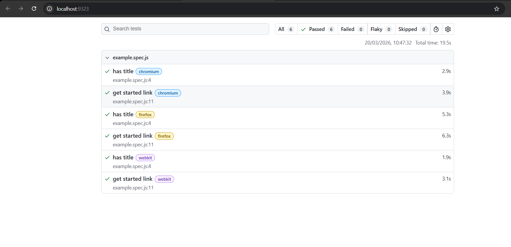

## Análise de Performance

Com base na execução dos testes automatizados (conforme imagem acima), foram extraídas as seguintes métricas:

* **Tempo total de execução:** 19.5s para 6 casos de teste (3 linhas de massa em 2 navegadores).
* **Média por cenário:** Aproximadamente 3.2 segundos.
* **Estabilidade:** O site do Banco Central apresentou um comportamento estável, sem quedas de conexão ou erros de carregamento durante as múltiplas requisições.

### Considerações Técnicas
1. **Navegadores:** O **Chromium** apresentou o melhor tempo de resposta, seguido pelo **Webkit**. O **Firefox** teve uma execução levemente mais lenta, o que é comum devido ao motor de renderização.
2. **Latência:** A resposta do servidor do Banco Central é consistente, permitindo uma automação fluida.
3. **Ferramenta de Diagnóstico:** Além dos relatórios nativos do Playwright, recomenda-se o uso do **Lighthouse** para auditorias de Core Web Vitals (LCP, FID, CLS) em futuras melhorias de UX.

